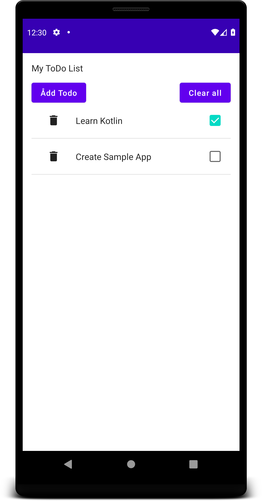

# hands_on_kotlin

Hands on Kotlin is a sample todo app, built with
[Jetpack Compose](https://developer.android.com/jetpack/compose). The goal of the sample is to
showcase text input, navigation, local database (room) and state capabilities of Compose.

To try out this app, you need to use the latest Canary version of Android Studio 4.2.
You can clone this repository or import the
project from Android Studio following the steps
[here](https://developer.android.com/jetpack/compose/setup#sample).

Screenshots
-----------
 

## Features

This sample contains 2 screens: a list of todos, where the user can view their todos, and a add todo screen.

### Room

Uses Room to save todos, locally.

- https://levelup.gitconnected.com/using-room-in-jetpack-compose-d2b6b674d3a5

### ViewModel

Uses ViewModel to manage state and display the changes in the todos instantly

- https://levelup.gitconnected.com/using-state-in-jetpack-compose-b7445b697736

### Navigation

Uses navigation composable for navigating between screens

### WorkManager

Backup on demand and periodic backup

